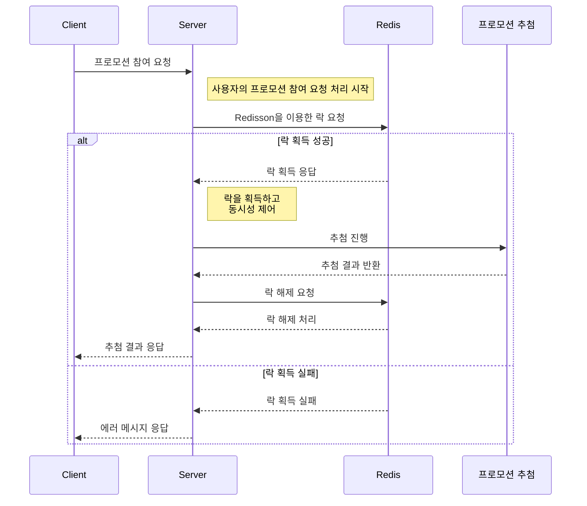

# 프로모션

이 프로젝트는 Redis의 Redisson 라이브러리와 사용자 정의 어노테이션을 활용한 AOP를 통해 Distributed Lock을 구현하였습니다. 이를 통해 프로모션 참여 시 발생하는 동시성 이슈를 테스트합니다. 주요 기능은 회원들에게 매일 한 번씩 프로모션에 참여할 기회를 제공하고, 추첨을 통해 보상을 주는 기능입니다.

#### 사용 기술

- Java, Gradle, SpringBoot, JUnit5, Mockito, Redis, JPA, QueryDSL

## 주요 기능

1. Distributed Lock
2. AOP

## 아키텍처 및 설계

### 1. Distributed Lock

#### 1.1 Redisson 사용

- Redisson은 Lettuce보다 다양한 기능을 제공
    - RLock 인터페이스 - 락 획득을 위한 최대 대기 시간(waitTime), 락 유지 시간(leaseTime)을 설정할 수 있는 기능을 제공
    - 락이 사용 가능할 때까지 자동으로 재시도하는 기능을 제공
    - 락을 유지하는 동안 주기적으로 락의 만료 시간을 갱신하는 기능을 제공
    - pub-sub 구조 (락을 획득하려는 프로세스들 간의 경합을 줄임으로써 시간 지연 최소화)

### 2. AOP

- @Aspect, @Around 어노테이션을 사용하여 메서드 수준에서 분산락 제어
    - 분산락 관리 중앙화

## Sequence Diagram

