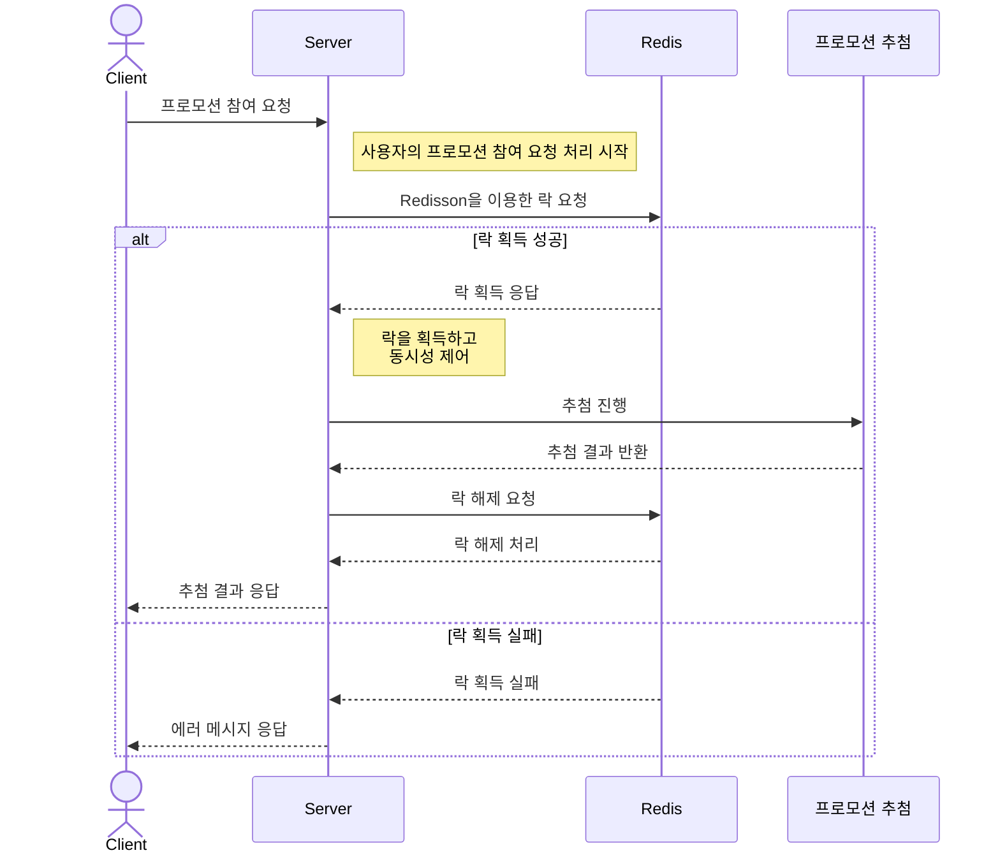

# 프로모션

이 프로젝트는 Redisson 라이브러리를 사용하여 Distributed Lock 기능을 AOP로 구현한 프로젝트로 핵심 목표는 프로모션 참여 시 발생할 수 있는 동시성 이슈를 해결하는 데 있습니다. 이 시스템은 회원들이 매일 한 번 프로모션에 참여할 수 있게 하며, 참여 결과에 따라 추첨을 통해 보상을 제공하는 기능을 포함하고 있습니다.

[](https://dbdocs.io/gmsdl1994/Distributed-Lock-Project)
[](https://topys-organization.gitbook.io/topys-promotion/)

#### 사용 기술

- Java, Gradle, SpringBoot, JUnit5, Mockito, Redis, JPA, QueryDSL

## 주요 기능

1. Distributed Lock
2. AOP

## 아키텍처 및 설계

### 1. Distributed Lock

#### 1.1 Redisson 사용

- Redisson은 Lettuce보다 다양한 기능을 제공
    - RLock 인터페이스 : 락 획득을 위한 최대 대기 시간(waitTime), 락 유지 시간(leaseTime)을 설정할 수 있는 기능을 제공
    - 락을 유지하는 동안 주기적으로 락 유지 시간(leaseTime)을 자동으로 갱신하는 기능을 제공
    - pub-sub 구조 (락을 획득하려는 프로세스들 간의 경합을 줄임으로써 시간 지연 최소화)

### 2. AOP

- @Aspect, @Around 어노테이션을 사용하여 메서드 수준에서 분산락 제어
    - 분산락 관리 중앙화

## Sequence Diagram



## 테스트

### 1. JMeter 테스트

#### 1.1 서론

1. 100개의 Reward와 100명의 사용자를 준비하고, 모든 사용자가 동시에 프로모션에 참여합니다.
2. 프로모션의 당첨 확률은 30%로 설정되어 있으며, 당첨된 사용자 수만큼 Reward가 감소하는지 확인합니다.

#### 1.2 Distributed Lock 사용 유무에 따른 비교


- 분산락을 적용하지 않았을 때, 100명의 참가자 중 24명이 당첨되었으나, 남은 Reward의 수는 91개로, 예상보다 적은 수의 Reward만이 감소하였다. 이는 동시성 문제로 인한 데이터 불일치를 나타낸다.

### 2. 분산락 테스트 코드

```java

@SpringBootTest
class RewardSearchServiceTest {

    @Test
    @DisplayName("Distributed Lock이 적용될 때 100명의 사용자가 프로모션에 동시 참여하여 Reward를 정확히 분배받는지 확인한다.")
    public void should_DistributeReward_when_ReceivedRewardFiftyThreads() throws Exception {
        // Arrange
        String promotionTitle = "Test Promotion";
        Rank mockRank = Rank.WIN;

        Promotion promotion = new Promotion(promotionTitle, LocalDateTime.now(), LocalDateTime.now().plusDays(10));
        promotionRepository.save(promotion);

        Reward reward = new Reward("세탁기", 100, mockRank, promotion);
        rewardRepository.save(reward);

        when(rewardCreateRankService.createRank()).thenReturn(mockRank);

        final int threadCount = 100;
        ExecutorService executor = Executors.newFixedThreadPool(threadCount);
        CountDownLatch startLatch = new CountDownLatch(1);
        CountDownLatch endLatch = new CountDownLatch(threadCount);

        // Act
        for (int threadIndex = 0; threadIndex < threadCount; threadIndex++) {
            executor.submit(() -> {
                try {
                    startLatch.await();
                    return sut.getWinnerReward(promotionTitle);
                } catch (InterruptedException e) {
                    Thread.currentThread().interrupt();
                } finally {
                    endLatch.countDown();
                }
                return null;
            });
        }
        startLatch.countDown();
        endLatch.await();
        executor.shutdown();

        // Assert
        Reward actual = rewardRepository.findById(1L).orElseThrow();
        Assertions.assertEquals(0, actual.getQuantity());
    }
}
```

### 3. Lock Watchdog

#### 3.1 WatchdogTimeout

- `leaseTimeout` 매개변수 없이 `RLock`을 획득했을 때 활성화되는 기능
- Lock 획득 후, `WatchdogTimeout` 주기의 1/3마다 `leaseTime`을 `lockWatchdogTimeout` 값으로 자동 갱신
    - 기본값(Default): 30 * 1000 milliseconds (30초)
- 외부 이슈(예: Redisson 클라이언트의 예기치 않은 중단)로 인해 `leaseTime`을 갱신하지 못할 경우, `WatchdogTimeout`이 경과한 이후 Lock 해제

#### 3.2 WatchdogTimeout 테스트 코드

```java

@SpringBootTest
public class RedissonWatchdogTest {

    @Test
    @DisplayName("`leaseTime`없이 Lock 획득 후 종료되었을 때, WatchdogTimeout이 잘 작동되는지 확인한다.")
    public void should_UnLock_When_WatchdogTimeoutExpireAfterShutdown() throws InterruptedException {
        // Arrange
        String lockKey = "Test Lock";

        Config config = new Config();
        config.useSingleServer().setAddress("redis://localhost:6379");
        config.setLockWatchdogTimeout(10 * 1000); // WatchdogTimeout을 10초로 설정

        RedissonClient lockingRedissonClient = Redisson.create(config);
        RLock lock = lockingRedissonClient.getLock(lockKey);

        // Act
        lock.lock(); // leaseTime 없이 락을 획득

        RedissonClient testingRedissonClient = Redisson.create(config);
        RLock lockForTest = testingRedissonClient.getLock(lockKey);

        assertThat(lockForTest.tryLock()).isFalse(); // 첫 번째 클라이언트가 락을 갖고 있기 때문에 락을 획득할 수 없음

        lockingRedissonClient.shutdown(); // 첫 번째 클라이언트 종료
        Thread.sleep(10 * 1000); // WatchdogTimeout 시간 동안 기다림

        // Assert
        assertThat(lockForTest.tryLock()).isTrue(); // 락이 해제되었는지 확인
    }
}
```