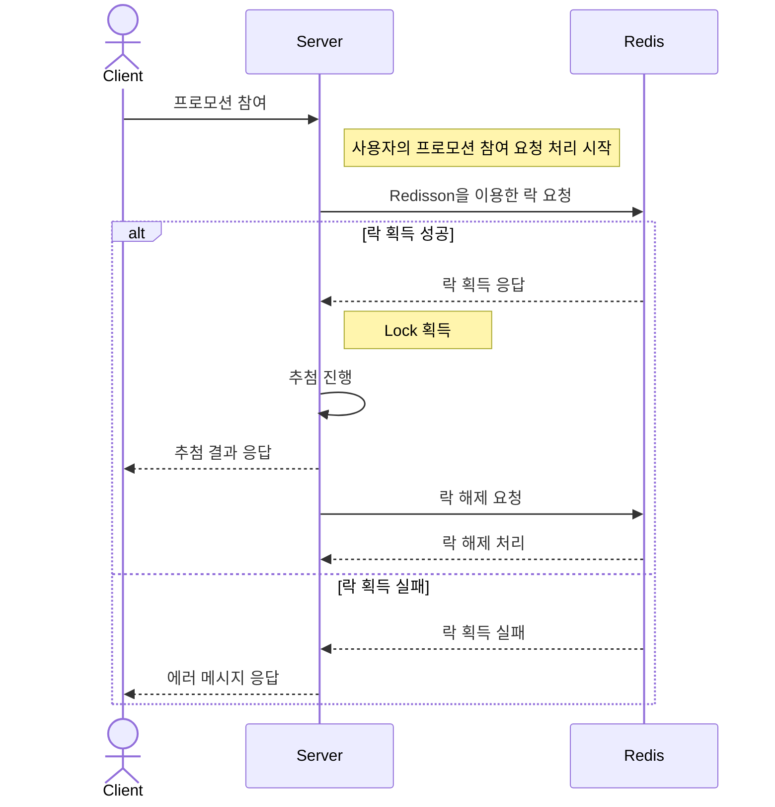

# 프로모션

이 프로젝트는 JMeter를 사용하여 발생시킨 동시성 이슈를 Redis를 활용한 분산락을 통해 제어하는 시스템으로, Redis 클라이언트인 Redisson와 AOP를 사용하여 구현했습니다.

프로젝트의 주요 목적은 멀티 쓰레드나 멀티 프로세스 상황에서 발생할 수 있는 동시성 이슈를 경험하고 분산락과 AOP에 대한 이해를 높이는 것입니다.

[](https://topys-organization.gitbook.io/topys-promotion/)

#### 사용 기술

- Java, SpringBoot, Redis, JPA, QueryDSL

#### 주요 기능

특정 기간 동안 진행되는 프로모션에서 사용자는 하루에 한 번 참여할 수 있습니다. 참여 즉시 당첨 또는 낙첨 결과가 나오며, 30% 확률로 당첨이 되는 방식입니다.

<br>

## 프로젝트 상세

### 1. 사용 기술

#### 분산락 (Distributed Lock)

- Redisson은 Lettuce보다 다양한 기능을 제공
    - RLock 인터페이스 : 락 획득을 위한 최대 대기 시간(waitTime), 락 유지 시간(leaseTime)을 설정할 수 있는 기능을 제공
    - pub-sub 구조 (락을 획득하려는 프로세스들 간의 경합을 줄임으로써 시간 지연 최소화)

#### AOP

- AOP 관련 어노테이션(@Aspect, @Around)을 사용하여 메서드 수준에서 분산 락을 설정합니다. 이를 통해 보일러플레이트 코드를 줄이고 분산 락 관리를 중앙화합니다.

<br>

### 2. Sequence Diagram



<br>

### 3. JMeter 테스트

1. 100개의 Reward와 100명의 사용자를 준비하고, 모든 사용자가 동시에 프로모션에 참여합니다.
2. 프로모션의 당첨 확률은 30%로 설정되어 있으며, 당첨된 사용자 수만큼 Reward가 감소하는지 확인합니다.

#### Distributed Lock 사용 유무에 따른 비교


- 분산 락을 적용하지 않은 경우, 100명의 참가자 중 24명이 당첨되었습니다.<br>그러나 남은 Reward의 개수는 91개로, 24명이 당첨되었음에도 불구하고 9명에게만 Reward가 제공되었습니다.<br>이는 동시성 이슈로 인한 데이터 불일치를 나타냅니다.

<br>

### 4. 분산락 테스트 코드

```java

@SpringBootTest
class RewardSearchServiceTest {

    @Test
    @DisplayName("Distributed Lock이 적용될 때 100명의 사용자가 프로모션에 동시 참여하여 Reward를 정확히 분배받는지 확인한다.")
    public void should_DistributeReward_when_ReceivedRewardFiftyThreads() throws Exception {
        // Arrange
        String promotionTitle = "Test Promotion";
        Rank mockRank = Rank.WIN;

        Promotion promotion = new Promotion(promotionTitle, LocalDateTime.now(), LocalDateTime.now().plusDays(10));
        promotionRepository.save(promotion);

        Reward reward = new Reward("세탁기", 100, mockRank, promotion);
        rewardRepository.save(reward);

        when(rewardCreateRankService.createRank()).thenReturn(mockRank);

        final int threadCount = 100;
        ExecutorService executor = Executors.newFixedThreadPool(threadCount);
        CountDownLatch startLatch = new CountDownLatch(1);
        CountDownLatch endLatch = new CountDownLatch(threadCount);

        // Act
        for (int threadIndex = 0; threadIndex < threadCount; threadIndex++) {
            executor.submit(() -> {
                try {
                    startLatch.await();
                    return sut.getWinnerReward(promotionTitle);
                } catch (InterruptedException e) {
                    Thread.currentThread().interrupt();
                } finally {
                    endLatch.countDown();
                }
                return null;
            });
        }
        startLatch.countDown();
        endLatch.await();
        executor.shutdown();

        // Assert
        Reward actual = rewardRepository.findById(1L).orElseThrow();
        Assertions.assertEquals(0, actual.getQuantity());
    }
}
```

<br>

### 5. lockWatchdogTimeout 테스트

**lockWatchdogTimeout**

- `leaseTimeout` 매개변수 없이 `RLock` 인스턴스를 생성했을 때 활성화되는 기능으로 Time to live(TTL) 시간을 lockWatchdogTimeout의 기본값인 30초로 설정 
- lockWatchdogTimeout의 1/2 시간마다 Redisson은 Redis Server에 TTL 연장 요청을 보내고 lockWatchdogTimeout의 값으로 연장

**테스트 코드**

```java
@SpringBootTest
public class RedissonWatchdogTest {

    @Test
    @DisplayName("Redis 클라이언트 종료 후 lockWatchdogTimeout이 동작하여 락이 해제되는지 확인한다.")
    public void should_UnLock_When_WatchdogTimeoutExpireAfterShutdown() throws InterruptedException {
        // Arrange
        String lockKey = "Test Lock";

        Config config = new Config();
        config.useSingleServer().setAddress("redis://localhost:6379");
        config.setLockWatchdogTimeout(10 * 1000); // lockWatchdogTimeout 10초로 설정

        RedissonClient redissonClient = Redisson.create(config);
        RLock lock = redissonClient.getLock(lockKey);
        
        // Act
        lock.lock(); // leaseTime 없이 락을 획득
        assertThat(lock.isLocked()).isTrue(); // 락이 걸려있는지 확인
      
        redissonClient.shutdown(); // Redis Client 종료
        Thread.sleep(11 * 1000); // lockWatchdogTimeout 시간 동안 기다림 (11초 대기)

        RedissonClient redissonClientForTest = Redisson.create(config);
        RLock lockForTest = redissonClientForTest.getLock(lockKey);
      
        // Assert
        assertThat(lockForTest.tryLock()).isTrue(); // lockWatchdogTimeout이 동작하여 락이 해제되었는지 확인
    }
}
```